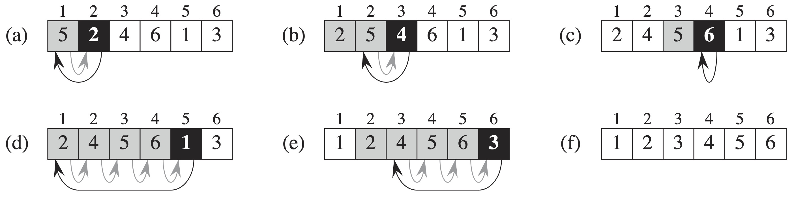

# 2 Getting Started

## 2.1 Insertion sort



```text
INSERTION-SORT
for j = 2 to A.length
    key = A[j]
    //Insert A[j] into the sorted sequence A[1 .. j - 1].
    i = j - 1
    while i > 0 and A[i] > key
        A[i + 1] = A[i]
        i = i - 1
    A[i + 1] = key
```

### Loop invariants and the correctness of insertion sort


**Loop Invariant:**

At the start of each iteration of the **for** loop of lines 1-8, the subarray A\[1 .. j - 1\] consists of the elements of originally in A\[1 .. j - 1\], but in sorted order.


Three things about a loop invariant:

* **Initialization:** It is true prior to the first iteration of the loop.
* **Maintenance:** If it is true before an iteration of the loop, it remains true before the next iteration.
* **Termination:** When the loop terminates, the invariant gives us a useful property that helps show that the algorithm is correct.

## 2.2 Analyzing algorithms

### Analysis of insertion sort

| INSERTION-SORT\(A\) | cost | times |
| :--- | :--- | :--- |
| **for** j = 2 **to A.length** | $$c_1$$ | $$n$$ |
|     key = A\[j\] | $$c_2$$ | $$n-1$$ |
|     //Insert A\[j\] into the sorted sequence A\[1 .. j - 1\]. | $$0$$ | $$n-1$$ |
|     i = j - 1 | $$c_4$$ | $$n-1$$ |
|     **while** i &gt; 0 and A\[i\] &gt; key | $$c_5$$ | $$\sum_{j=2}^{n} t_j$$ |
|         A\[i+1\] = A\[i\] | $$c_6$$ | $$\sum_{j=2}^n (t_j - 1)$$ |
|         i = i - 1 | $$c_7$$ | $$\sum_{j=2}^n (t_j - 1)$$ |
|     A\[i + 1\] = key | $$c_8$$ | $$n - 1$$ |

\_\_$$t_j$$_denote the number of times the **while** loop test in line 5 is executed for that value of j._

The best-case running time is

$$\begin{aligned}T(n) &= c_1 n + c_2 (n-1) + c_4 (n-1) +c_5 (n-1) +c_8 (n-1)\\ &= (c_1 + c_2 + c_4 + c_5 + c_8)n - (c_2 + c_4 + c_5 + c_8).\end{aligned}$$

The worst-case running time is

$$\begin{aligned} T(n) &= c_1 n + c_2 (n-1) + c_4 (n-1) + c_5 (\frac{n(n+1)}{2}-1)+c_6 (\frac{n(n-1)}{2}) +c_7 (\frac{n(n-1)}{2}) + c_8 (n-1) \\&= (\frac{c_5}{2} + \frac{c_6}{2} + \frac{c_7}{2})n^2 + (c_1 + c_2 +c_4 + \frac{c_5}{2} - \frac{c_6}{2} - \frac{c_7}{2} + c_8)n - (c_2+c_4+c_5+c_8).\end{aligned}$$

### Worst-case and average-case analysis

We shall usually concentrate on finding only the _**worst-cast running time**_**:**

* The worst-case running time of an algorithm gives us an upper bound on the running time for any input.
* For some algorithms, the worst case occurs fairly often.
* The "average case" is often roughly as bad as the worst case.

### Order of growth

Considering only the leading term of formula and ignore the leading term's constant coefficient.

We usually consider one algorithm to be more efficient than another if its worst-case running time has a lower order of growth.

