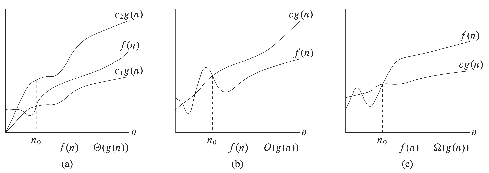

# 3 Growth of Functions

## 3.1 Asymptotic notation

_**Theorem 3.1**_

For any two functions $$f(n)$$ and $$g(n)$$, we have $$f(n) = \Theta(g(n))$$ if and only if $$f(n)=O(g(n))$$ and $$f(n)=\Omega(g(n))$$.

**Transitivity:**

$$f(n)=\Theta(g(n))\ \text{and}\ g(n) = \Theta(h(n))\ \text{imply}\ f(n)=\Theta(h(n)),$$

$$f(n)=O(g(n))\ \text{and}\ g(n) = O(h(n))\ \text{imply}\ f(n)=O(h(n)),$$

$$f(n)=\Omega(g(n))\ \text{and}\ g(n) = \Omega(h(n))\ \text{imply}\ f(n)=\Omega(h(n)),$$

$$f(n)=o(g(n))\ \text{and}\ g(n) = o(h(n))\ \text{imply}\ f(n)=o(h(n)),$$

$$f(n)=\omega(g(n))\ \text{and}\ g(n) = \omega(h(n))\ \text{imply}\ f(n)=\omega(h(n)).$$

**Reflexivity:**

$$f(n) = \Theta(f(n)),$$

$$f(n) = O(f(n)),$$

$$f(n) = \Omega(f(n)).$$

**Symmetry:**

$$f(n) = \Theta(g(n)) \text{ if and only if } g(n) = \Theta(f(n)).$$

**Transpose symmetry:**

$$f(n) = O(g(n)) \text{ if and only if } g(n) = \Omega(f(n)),$$

$$f(n) = o(g(n)) \text{ if and only if } g(n) = \omega(f(n)).$$


**Notes:**

\*\*\*\*$$f(n) = O(g(n)) \text{ is like } a\leq b$$

$$f(n) = \Omega(g(n)) \text{ is like } a\geq b,$$

$$f(n) = \Theta(g(n)) \text{ is like } a = b,$$

$$f(n) = o(g(n)) \text{ is like } a < b,$$

$$f(n) = \omega(g(n)) \text{ is like } a> b.$$



Although any two real numbers can be compared, not all functions are asymptotically comparable.


