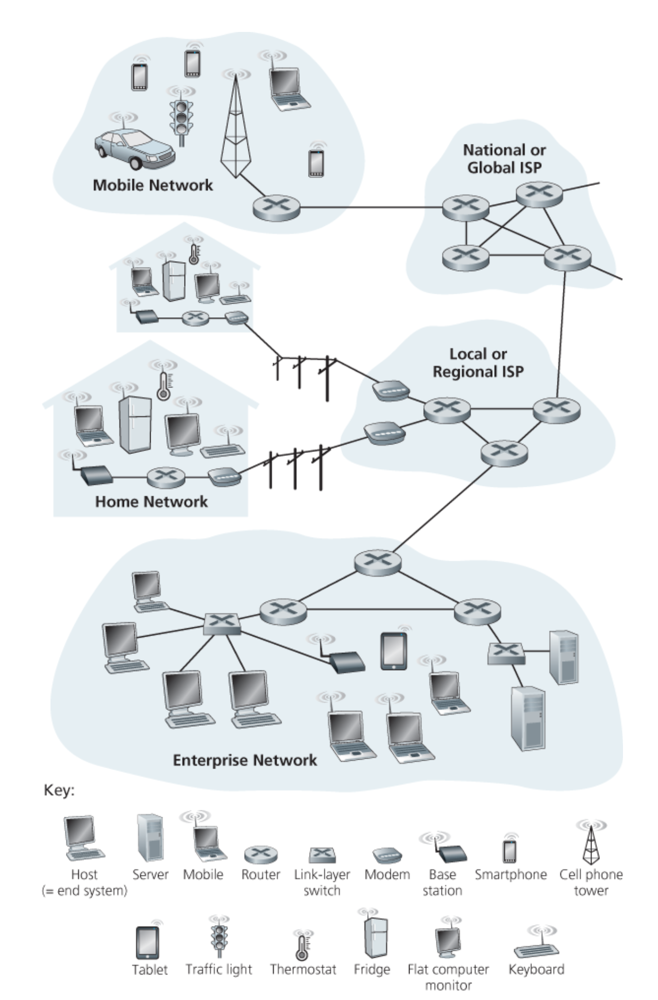

# 1.1 What Is the Internet?

## 1.1.1 A Nuts-and-Bolts Description

In Internet jargon, all of devices that are being hooked up to the Internet are called **hosts** or **end systems**.

End systems are connected together by a network of **communication links** and **packet switches**.

The two most prominent types in today's Internet are **routers** and **link-layer switches**. Link-layer switches are typically used in access networks, while routers are typically used in the network core.

The **Transmission Control Protocol \(TCP\)** and the **Internet Protocol \(IP\)** are two of the most important protocols in the Internet.

## 1.1.2 A Services Description

