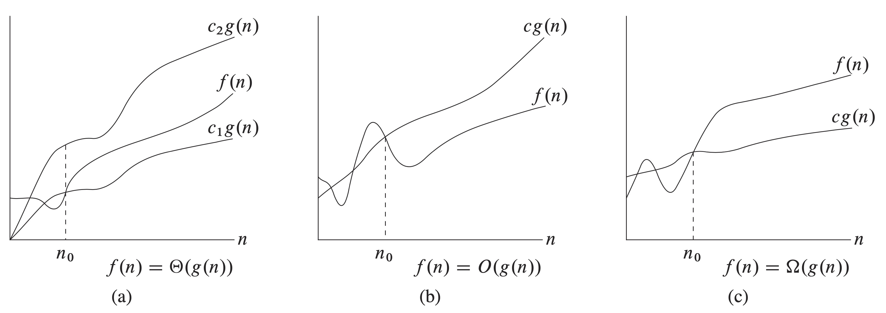

# 3 Growth of Functions

## 3.1 Asymptotic notation

### Asymptotic notation, functions, and running times

The asymptotic notation can not only apply to functions that **characterize the running times of algorithms**, also can apply to functions that **characterize some other aspect of algorithms** \(the amount of space they use, for example\), or even to functions that have nothing whatsoever to do with algorithms.

We shall see asymptotic notations that are well suited to characterizing running times no matter what the input.

_In each part, the value of_ $$n_0$$_shown is the minimum possible value; any greater value would also work._

#### Θ-notation

We found that the worst-case running time of insertion sort is $$T(n)=\Theta(n^2)$$. For a given function $$g(n)$$, we denote by $$\Theta(g(n))$$ the _set of functions_

$$
\begin{equation}\begin{aligned}\Theta(g(n))=\{f(n): &\text { there exist positive constants } c_{1}, c_{2}, \text { and } n_{0} \text{ such that} \\
&0 \leq c_{1} g(n) \leq f(n) \leq c_{2} g(n) \text { for all } n \geq n_{0}\}\end{aligned}\end{equation}
$$

_\*\*\*\*_

A function of $$f(n)$$ belongs to the set $$\Theta(g(n))$$ if there exist positive constant $$c_1$$ and $$c_2$$ such that it can be "sandwiched" between $$c_1g(n)$$ and $$c_2g(n)$$, for sufficiently large n. We usually use $$f(n) = \Theta(g(n))$$ to express the same notion.

From Figure 3.1\(a\), we say that $$g(n)$$ is an _**asymptotically tight bound**_ for $$f(n)$$.

The definition of $$\Theta(g(n))$$ requires that every member $$f(n)\in \Theta(g(n))$$ be _**asymptotically nonnegative**_, that is, that $$f(n)$$ be nonnegative whenever $$n$$ is sufficiently large. Consequently, the function $$g(n)$$ itself must be asymptotically nonnegative, or else the set $$\Theta(g(n))$$ is empty. We shall therefore assume that every function used within Θ-notation is asymptotically nonnegative. This assumption holds for the other asymptotic notations.

> An _**asymptotically positive**_ function is one that is positive for all sufficiently large $$n$$.


**Proof of** $$\frac{1}{2}n^2 - 3n = \Theta(n^2)$$

We must determine positive constants $$c_1$$, $$c_2$$, and $$n_0$$ such that

$$c_{1} n^{2} \leq \frac{1}{2} n^{2}-3 n \leq c_{2} n^{2}$$ 

for all $$n\geq n_0$$. Dividing by $$n^2$$ yields

$$c_{1} \leq \frac{1}{2}-\frac{3}{n} \leq c_{2}$$ 

For any $$n\geq 1$$and $$c_2\geq  1/2$$, the right-hand inequality holds.

For any $$n\geq 7$$ and $$c_1 \leq 1/14$$, the left-hand inequality holds.


#### O-notation

When we have only an _**asymptotically upper bound**_, we use O-notation. For a given function $$g(n)$$, we denote by $$\Theta(g(n))$$ the _set of functions_

$$
\begin{equation}\begin{aligned}O(g(n))=\{f(n): &\text { there exist positive constants } c \text { and } n_{0} \text{ such that} \\
&0 \leq f(n) \leq c g(n) \text { for all } n \geq n_{0}\}\end{aligned}\end{equation}
$$


The $$\Theta(n^2)$$ bound on the worst-case running time of insertion sort, however, does not imply a $$\Theta(n^2)$$ bound on the running time of insertion sort on _every_ input.

For example, when the input is already sorted, insertion sort runs in $$\Theta(n)$$ time.

But the $$O(n^2)$$ bound on worst-case running time of insertion sort also apllies to its running time on every input.


#### Ω-notation

Ω-notation provides an **asymptotic lower bound.** For a given function $$g(n)$$, we denote by $$\Theta(g(n))$$ the _set of functions_

$$
\begin{equation}\begin{aligned}O(g(n))=\{f(n): &\text { there exist positive constants } c \text { and } n_{0} \text{ such that} \\
&0 \leq c g(n) \leq f(n) \text { for all } n \geq n_{0}\}\end{aligned}\end{equation}
$$

_**Theorem 3.1**_

For any two functions $$f(n)$$ and $$g(n)$$, we have $$f(n) = \Theta(g(n))$$ if and only if $$f(n)=O(g(n))$$ and $$f(n)=\Omega(g(n))$$.

### Asymptotic notation in equations and inequalities

The formula $$2n^2 + 3n+1=2n^2+\Theta(n)$$ means that $$2n^2+3n+1=2n^2+f(n)$$, where $$f(n)$$ is some function in the set $$\Theta(n)$$.


$$2n^2+\Theta(n)=\Theta(n^2)$$

This means that for _any_ function $$f(n)\in \Theta(n)$$, there is _some_ function $$g(n)\in \Theta(n^2)$$ such that $$2n^2+f(n)=g(n)$$ for all $$n$$. In other words, the right-hand side of an equation provides a coarser level of detail than the left-hand side.


#### o-notation

We use o-notation to denote an upper bound that is not asymptotically tight. We formally define o\(g\(n\)\) as the set

$$
\begin{equation}\begin{aligned}o(g(n))=\{f(n): &\text { for any positive constants } c > 0 \text { there exists a constant }\\ &n_{0} \text{ such that }
0 \leq f(n) < cg(n) \text { for all } n \geq n_{0}\}\end{aligned}\end{equation}
$$

The main difference between the definitions of O-notation and o-notation is that in $$f(n)=O(g(n))$$, the bound $$0 \leq f(n) \leq cg(n)$$ holds for _some_ constant $$c>0$$, but in $$f(n)=o(g(n))$$, the bound $$0\leq f(n) < cg(n)$$ holds for all constants $$c>0$$. Intuitively, in o-notation, the function $$f(n)$$ becomes insignificant relative to $$g(n)$$ as $$n$$ approaches infinity; that is,

$$
\lim _{n \rightarrow \infty} \frac{f(n)}{g(n)}=0
$$

#### ω-notation

We use ω-notation to denote a lower bound that is not asymptotically tight. We define $$\omega(g(n))$$ as the set .

$$
\begin{equation}\begin{aligned}\omega(g(n))=\{f(n): &\text { for any positive constants } c > 0 \text { there exists a constant }\\ &n_{0} \text{ such that }
0 \leq  cg(n) <f9n) \text { for all } n \geq n_{0}\}\end{aligned}\end{equation}
$$

The relation $$f(n) = \omega(g(n))$$ implies that

$$
\lim _{n \rightarrow \infty} \frac{f(n)}{g(n)}=\infty
$$

, if the limit exists.

### Comparing functions

#### **Transitivity:**

$$f(n)=\Theta(g(n))\ \text{and}\ g(n) = \Theta(h(n))\ \text{imply}\ f(n)=\Theta(h(n)),$$

$$f(n)=O(g(n))\ \text{and}\ g(n) = O(h(n))\ \text{imply}\ f(n)=O(h(n)),$$

$$f(n)=\Omega(g(n))\ \text{and}\ g(n) = \Omega(h(n))\ \text{imply}\ f(n)=\Omega(h(n)),$$

$$f(n)=o(g(n))\ \text{and}\ g(n) = o(h(n))\ \text{imply}\ f(n)=o(h(n)),$$

$$f(n)=\omega(g(n))\ \text{and}\ g(n) = \omega(h(n))\ \text{imply}\ f(n)=\omega(h(n)).$$

#### **Reflexivity:**

$$f(n) = \Theta(f(n)),$$

$$f(n) = O(f(n)),$$

$$f(n) = \Omega(f(n)).$$

#### **Symmetry:**

$$f(n) = \Theta(g(n)) \text{ if and only if } g(n) = \Theta(f(n)).$$

#### **Transpose symmetry:**

$$f(n) = O(g(n)) \text{ if and only if } g(n) = \Omega(f(n)),$$

$$f(n) = o(g(n)) \text{ if and only if } g(n) = \omega(f(n)).$$


**Notes:**

\*\*\*\*$$f(n) = O(g(n)) \text{ is like } a\leq b$$

$$f(n) = \Omega(g(n)) \text{ is like } a\geq b,$$

$$f(n) = \Theta(g(n)) \text{ is like } a = b,$$

$$f(n) = o(g(n)) \text{ is like } a < b,$$

$$f(n) = \omega(g(n)) \text{ is like } a> b.$$



Although any two real numbers can be compared, not all functions are asymptotically comparable.


## 3.2 Standard notations and common functions

### **Monotonicity** 

A function $$f(n)$$ is **monotonically increasing** if $$m\leq󿰎 n$$ implies $$f(m)\leq 󿰎 f(n)$$. Similarly, it is **monotonically decreasing** if $$m \geq n$$ implies $$f(m) \geq 󿰃 f(n)$$. A function $$f(n)$$ is **strictly increasing** if $$m < n$$ implies $$f(m) < f(n)$$ and **strictly decreasing** if $$m < n$$ implies $$f(m) > f(n)$$.   

