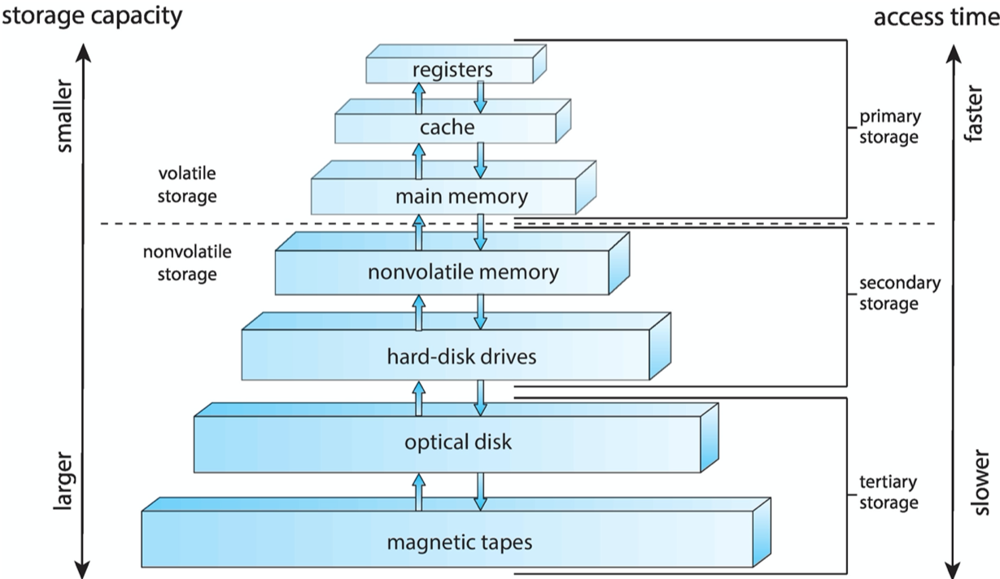

# Chapter 1 Introduction

## 1.1 What Operating Systems Do

A computer system can be divided roughly into four components: the **hardware,** the **operating system,** the **application programs,** and a **user** \(Figure 1.1\).


We can also view a computer system as consisting of hardware, software and data.


### 1.1.1 User View

The operating system is designed mostly for **ease of use**, with some attention paid to performance and security and none paid to **resource utilization.**


Some computers have little or no user view. For example, **embedded computers**.


### 1.1.2 System View

From the computer's points of view, the operating system is a **resource allocator** or a **control program** that manages the execution of user programs to prevent errors and improper user of the computer.

### 1.1.3 Defining Operating Systems

In general, we have no completely adequate definition of an operating system. 

In addition, we have no universally accepted definition of what is part of the operating system.


**Note:**

**A common definition:**

* **Kernel:** The one program running at all times.
* **System Programs:** Associated with the operating system but not necessarily part of the **kernel**.
* **Application Programs:** All programs not associated with the operating system.


## 1.2 Computer-System Organization

One or more CPUs, device controllers connect through common **bus** providing access to shared memory.


There may be many buses with a computer system, but the system bus is the main communications path between the major components.


Concurrent execution of CPUs and devices competing for memory cycles.

Each device controller has a local buffer and each type has an operating system **device driver** to manage it.

### 1.2.1 Interrupts

Device controller informs CPU that it has finished its operation by causing an **interrupt**. Interrupt is a key part of how operating system and hardware interact.

#### 1.2.1.1 Overview

Interrupt transers control to the interrupt service routine generally, through the **interrupt vector**, which contains the addresses of all the service routines.

The interrupt architecture must also save the state information of whatever was interrupted.

#### 1.2.1.2 Implementation

When the CPU detects that a controller has asserted a signaal on the **interrupt-request line**, it reads the interrupt number and jumps to the **interrupt-handler routine** by using that interrupt number as an index into the interrupt vector.


The CPU hardware has a wire called the **interrupt-request line** that the CPU senses after executing every instruciton.

We say that the device controller _**raises**_ an interrupt by asserting a signal on the interrupt request line, the CPU _**catches**_ the interrupt and _**dispatches**_ it to the interrupt handler, and the handler _**clears**_ the interrupt by servicing the device.



**Note:**

In practice, computers have more devices that they have address elements in the interrupt vector.

A common way to solve this problem is to use **interrupt chaining**, in which each element in the interrupt vector points to the head of a list of interrupt handlers.

When an interrupt is raised, the handlers on the corresponding list are called one by one, until one is found that can services the request.


_**Most CPUs have two interrupt request lines:**_

1. **The nonmaskable interrupt**, which is reserved for events such as unrecoverable memory errors.
2. **Maskable:** it can be turned off by the CPU before the execution of critical instruction sequences that must not be interrupted. It's used by device controllers to request services.


**In modern computer hardware, we need more sophisticated interrupte-handling features:**

1. We need **the ability to defer interrupt handling** during critical processing.
2. We need **an efficient way to dispatch** to the proper interrupt handler for a device.
3. We need **multilevel interrupts**, so that the operating system can distinguish between high- and low-priority interrupts and can respond with the appropriate degree of urgency.

These thress features are provided by the **CPU** and the **interrupt-controller hardware**.


### 1.2.2 Storage Structure

The first program to run on ocmputer power-on is a **bootstrap program**, which then loads the operating system.  It typically stored in ROM or EPROM, generally known as **firmware**.

The top four levels of memory in the figure are constructed using **semiconductor memory**.

The most common form of NVM device is flash memory.

### 1.2.3 I/O Structure

The form of interrupt-driven I/O described in [Section 1.2.1](chapter-1-introduction.md#1-2-1-interrupts) is fine for moving small amounts of data but can produce high overhead when used for bulk data movement such as NVS I/O. To solve this problem, **direct memory access \(DMA\)** is used.

* Device controller transfers blocks of data from buffer storage directly to main memory without CPU intervention.
* Only one interrupt is generated per block, rather than the one interrupt per byte.

## 1.3 Computer-System Architecture

### 1.3.1 Single-Processor Systems

One main CPU which manages the computer and runs user apps.

Other specialized processors \(sidk controllers, GPUs, etc.\) don't run user apps.

### 1.3.2 Multiprocessor Systems

The most common multiprocessor systems use **symmetric multiprocessing \(SMP\)**, in which each peer CPU processor performs all tasks, including operating-system functions and user processes.

The definition of _**multiprocessor**_ has evolved over time and now includes **multicore** systems, in which multiple computing cores reside on a single chip.

* Multicore systems can be more efficient than multiple chips with single cores because on-chip communication is faster than between-chip communication.
* One chip with multiple cores uses significantly less power than multiple single-core chips.


A **level 2 \(L2\)** **cache** is local to the chip but is shared by the two processing cores. 


In NUMA multiprocessing architecture, when a CPU access its local memory not only is it fast, but there is also no contention over the system interconnect. Thus, NUMA systems can scale more effectively as more processors are added.

**Blade servers** are systems in which multiple processor boards, I/O boards, and networking boards are placed in the same chassis.

### 1.3.3 Clustered Systems

A **clustered system** gathers together multiple CPUs. It differ from the multiprocessor systems described in [Section 1.3.2](chapter-1-introduction.md#1-3-2-multiprocessor-systems) in that they are composed of two or more individual systems—or nodes—joined together; each node is typically a multicore system. Such systems are considered **loosely coupled**.


A generally accepted definition of _**clustered**_ is that clustered computers share storage and are closely linked via a local-area network LAN or a faster interconnect, such as InfiniBand.


Clustering can be structured **asymmetrically** or **symmetrically**.

* In **asymnmetric clustering**, one machine is in **hot-standby mode** while the other is running the applications. When that server fails, the host-standby host becomes the active server.
* In **symmetric clustering**, two or more hosts are running applications and are monitoring each other.

Some cluster technology have **distributed lock manager \(DLM\)** to avoid conflicting operations.

## 1.4 Operating-System Operations

Another form of interrupt is a **trap** \(or an **exception**\), which is a software-generated interrupt caused either by an error or by a specific request from a user program that an operating-system service be performed by executing a special operation called a system call.

### 1.4.1 Multiprogramming and Multitasking

**Multiprogramming** increases CPU utilization, as well as keeping users satisfied, by organizing programs so that the CPU always has one to execute. In a multiprogrammed system, a program in execution is termed a **process**.

In **multitasking** systems, the CPU executes multiple processes by switching among them, but the switches occur frequently, providing the user with a fast **response time**.

### 1.4.2 Dual-Mode and Multimode Operation

**Dual-Mode** operation allows operating system to protect itself and other system components.

* **User Mode \(mode bit 1\):** the computer system is executing on behalf of a user application.
* **Kernel Mode \(mode bit 0\)**

The hardware allows privileged instructions to be executed only in kernel mode.


**Privileged Instructions** are the machine instructions that may cause harm.


System calls provide the means for a user program to ask the operating system to perform tasks reserved for the operating system on the user program's behalf.

### 1.4.3 Timer

A **timer** can be set to interrupt the computer after a specified period.

* A **variable timer** is generally implemeted by a fixed-rate clock and a counter.
* **Fixed timer**: e.g. 1/60 seconds.

## Resource Management

### 1.5.1 Process Management

A process needs certain resources—including **CPU time, memory, files, and I/O devices**—to accomplish its task.

