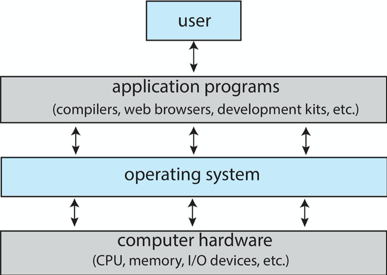

# 1.1 What Operating Systems Do

A computer system can be divided roughly into four components: the **hardware,** the **operating system,** the **application programs,** and a **user** \(Figure 1.1\).


We can also view a computer system as consisting of hardware, software and data.


## 1.1.1 User View

The operating system is designed mostly for **ease of use**, with some attention paid to performance and security and none paid to **resource utilization.**


Some computers have little or no user view. For example, **embedded computers**.


## 1.1.2 System View

From the computer's points of view, the operating system is a **resource allocator** or a **control program** that manages the execution of user programs to prevent errors and improper user of the computer.

## 1.1.3 Defining Operating Systems

In general, we have no completely adequate definition of an operating system. 

In addition, we have no universally accepted definition of what is part of the operating system.


**Note:**

**A common definition:**

* **Kernel:** The one program running at all times.
* **System Programs:** Associated with the operating system but not necessarily part of the **kernel**.
* **Application Programs:** All programs not associated with the operating system.


